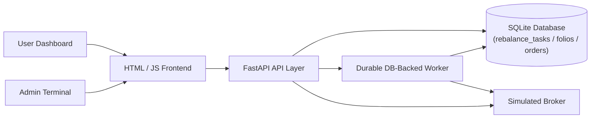

# StockWiz - Basket-Trading & Auto-Rebalancing System

StockWiz is a basket-trading platform prototype built with **FastAPI**, **SQLAlchemy (SQLite/PostgreSQL)**, and **Vanilla JavaScript/Tailwind CSS**. 

Users can subscribe to curated stock bundles called **Folios** (each containing exactly 12 stocks) with a quantity multiplier (e.g., `1x`, `2x`, `3x`, `5x`). Administrators can replace stocks inside a Folio, and the system automatically cascades the changes to all active subscribers of that Folio asynchronously with full durability and concurrency protection.

---

## 1. Setup & Installation

### Prerequisites
- Python 3.10+ installed and on your system path.

### Step 1: Clone and Navigate to Directory
```bash
cd StockWiz
```

### Step 2: Install Dependencies
```bash
pip install -r requirements.txt
```

### Step 3: Run the Application
Start the Uvicorn development server:
```bash
python -m uvicorn app.main:app --reload
```

The application will start on `http://127.0.0.1:8000`.
- **Frontend Dashboard**: Open `http://127.0.0.1:8000/` in your browser.
- **FastAPI Swagger Docs**: Open `http://127.0.0.1:8000/docs` in your browser.

---

## 2. Architecture & Design



### Durable Async Rebalancing & Concurrency Design (Critical Path)
When an administrator triggers a stock swap (e.g., swapping `RELIANCE` for `IDEA` in Folio A):
1. **Concurrency Lock**: The API checks `folio.is_rebalancing`. If another rebalance is already executing on the same folio, it returns `409 Conflict`, preventing race conditions and inconsistent states.
2. **Immediate Composition Update**: The outgoing stock is deleted and the incoming stock is added to the folio composition in the database atomically.
3. **Durable Task Persistence**: The backend queries all active subscriptions for that folio and inserts persistent records into the `rebalance_tasks` table (`status = PENDING`).
4. **Instant Response**: The API responds with HTTP 202 (Accepted) immediately, returning the count of active subscribers queued without blocking the HTTP worker thread.
5. **Background Cascade Worker with Crash Recovery**:
   - The worker loop monitors the `rebalance_tasks` table for `PENDING` records.
   - For each task, it updates the record status to `PROCESSING`, executes `SELL outgoing` + `BUY incoming` trades via the simulated broker with unique idempotency keys, records order execution receipts, and updates status to `COMPLETED`.
   - **Crash Recovery**: Upon startup or restart, the worker automatically detects and recovers any stuck `PROCESSING` tasks, ensuring zero task loss across application restarts.
   - Once all tasks for a folio are completed, the worker automatically releases the Folio's `is_rebalancing` lock and increments `folio.version_id`.

### Transaction Atomicity
- All subscription creations (`subscribe()`) and exits (`exit_subscription()`) execute their 12 broker trades within atomic database transaction blocks. If any trade fails, the transaction rolls back cleanly, ensuring no orphaned subscriptions or half-liquidated positions ever persist.

### Persistence Design
- Built on **SQLAlchemy 2.0** with SQLite (`stockwiz.db`).
- Seeds **7 distinct Folios**, each containing exactly **12 stocks** with strict startup validation (12-stock rule, ticker uniqueness, positive base quantities).
- Uses absolute filesystem path resolution via `pathlib.Path` to eliminate working-directory launch errors.

---

## 3. API Surface

### Folios
- `GET /api/folios` — List all 7 seeded folios with their stocks.
- `GET /api/folios/{folio_id}` — Get detailed stock composition of a specific folio.

### Subscriptions
- `POST /api/subscriptions` — Subscribe a user to a folio with a multiplier (executes 12 BUY orders atomically).
  - **Body**:
    ```json
    {
      "user_id": "user-101",
      "folio_id": 1,
      "multiplier": 3
    }
    ```
- `GET /api/users/{user_id}/subscriptions` — List all subscriptions for a user.
- `POST /api/subscriptions/{subscription_id}/exit` — Exit a folio, deactivating the subscription and liquidating all 12 current positions atomically.

### Orders / Execution Receipts
- `GET /api/orders` — View execution receipts (supports `user_id`, `limit`, and `offset` query parameters).

### Admin Tools
- `POST /api/admin/rebalance` — Trigger stock swap in a folio with concurrency lock and durable queueing.
  - **Body**:
    ```json
    {
      "folio_id": 1,
      "outgoing_ticker": "RELIANCE",
      "incoming_ticker": "IDEA",
      "new_base_quantity": 2.0
    }
    ```
- `GET /api/admin/queue` — Query durable background rebalance worker metrics (pending, processing, completed, and failed counts).

---

## 4. Run Automated Tests

To run the full suite of **18 automated tests** covering subscriptions, exits, rebalancing, concurrency locks, transaction atomicity, durable task recovery, and broker execution:
```bash
python -m pytest -v
```
