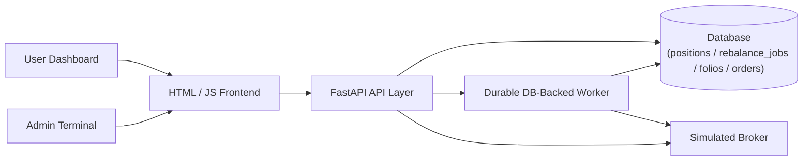

# StockWiz — Basket-Trading & Auto-Rebalancing System

StockWiz is a stateful basket-trading engine built with **FastAPI**, **SQLAlchemy**, and an **asynchronous durable worker queue**. 

Users can subscribe to curated stock bundles called **Folios** (each containing exactly 12 stocks) with a quantity multiplier (e.g., `1x`, `2x`, `3x`, `5x`). Administrators can replace stocks inside a Folio, and the system automatically cascades the changes to all active subscribers of that Folio asynchronously with atomic concurrency protection, per-user position tracking, and full worker durability.

---

## 1. Setup & Installation

### Prerequisites
- Python 3.10+ installed and on your system path.

### Step 1: Clone and Navigate to Directory
```bash
cd StockWiz
```

### Step 2: Install Dependencies
```bash
pip install -r requirements.txt
```

### Step 3: Run the Application
Start the Uvicorn development server:
```bash
python -m uvicorn app.main:app --reload
```

The application will start on `http://127.0.0.1:8000`.
- **Frontend Dashboard**: Open `http://127.0.0.1:8000/` in your browser.
- **FastAPI Swagger Docs**: Open `http://127.0.0.1:8000/docs` in your browser.

---

## 2. Architecture & Concurrency Design



### Key Senior-Level Architectural Invariants:
1. **Core Basket-Trading Invariant**:
   $$\text{User Order Quantity} = \text{Folio Base Quantity} \times \text{User-Specific Multiplier}$$
2. **Explicit Position Ledger (`Position` model)**:
   - When a user subscribes, 12 explicit `Position` records are created (`quantity = base_quantity * multiplier`).
   - During rebalancing, the worker marks the outgoing stock position as `LIQUIDATED` and creates an `ACTIVE` position for the incoming stock.
   - When a user exits, the system liquidates their actual held `Position` records, ensuring 100% position accuracy even across multiple historical rebalances or mid-flight operations.
3. **Atomic Concurrency Lock (`UPDATE folios SET is_rebalancing = 1 ... WHERE is_rebalancing = 0`)**:
   - Rebalancing acquires an atomic database row conditional lock. Competing concurrent rebalance requests for the same Folio receive `409 Conflict` at the database level.
4. **Active Subscription Uniqueness (`uq_active_user_folio`)**:
   - A database partial unique index on `subscriptions(user_id, folio_id) WHERE active = 1` prevents race conditions where concurrent requests could create duplicate active subscriptions for the same user.
5. **RebalanceJob Batch Orchestration (`RebalanceJob` entity)**:
   - Rebalancing operations create a parent `RebalanceJob` record. Child tasks are linked via `job_id`, providing clean batch lifecycle tracking (`PENDING` $\rightarrow$ `PROCESSING` $\rightarrow$ `COMPLETED` / `PARTIAL_FAILURE`).
6. **Durable In-Process Background Worker**:
   - Background tasks are persisted in the database with atomic row-level claim queries (`UPDATE rebalance_tasks SET status = 'PROCESSING' WHERE id = :id AND status = 'PENDING'`).
   - **Crash Recovery**: Automatically resets stuck `PROCESSING` tasks to `PENDING` on startup, guaranteeing zero task loss across restarts.
   - **Broker Idempotency**: Trade execution keys (`rebal-{task_id}-{ticker}-{action}`) are uniquely indexed in the database to guarantee at-least-once recovery without duplicate fills.

### Persistence Strategy (SQLite vs. PostgreSQL)
- **Prototype Default**: SQLite with WAL (`PRAGMA journal_mode=WAL`) and `PRAGMA busy_timeout=30000` for zero-configuration local evaluation.
- **Production Architecture**: The data layer is decoupled via SQLAlchemy 2.0 ORM models and is directly compatible with PostgreSQL (`postgresql://...`) for multi-replica deployments with PostgreSQL row-level locks (`SELECT ... FOR UPDATE`) and Celery/Arq worker queues.

---

## 3. API Surface

| Method | Endpoint | Description |
|---|---|---|
| `GET` | `/api/folios` | List all 7 seeded Folios with their 12 constituent stocks |
| `GET` | `/api/folios/{folio_id}` | Detailed stock composition of a specific Folio |
| `POST` | `/api/subscriptions` | Subscribe user with multiplier (12 atomic BUY orders + 12 Positions) |
| `GET` | `/api/users/{user_id}/subscriptions` | List all active and exited subscriptions for a user |
| `POST` | `/api/subscriptions/{id}/exit` | Exit a Folio, deactivating subscription and liquidating held positions |
| `GET` | `/api/orders` | Query immutable broker execution receipts (exact user_id filter, pagination) |
| `POST` | `/api/admin/rebalance` | Trigger atomic stock replacement with asynchronous fan-out cascade |
| `GET` | `/api/admin/queue` | Live telemetry for background rebalance jobs and task queues |

---

## 4. Runnable Example API Calls (curl)

### 1. List All Folios
```bash
curl -X GET "http://127.0.0.1:8000/api/folios" -H "Accept: application/json"
```

### 2. Subscribe User to a Folio (e.g. user-101 @ 3x Multiplier)
```bash
curl -X POST "http://127.0.0.1:8000/api/subscriptions" \
  -H "Content-Type: application/json" \
  -d '{
    "user_id": "user-101",
    "folio_id": 1,
    "multiplier": 3.0
  }'
```
**Response (201 Created)**:
```json
{
  "subscription": {
    "id": 1,
    "user_id": "user-101",
    "folio_id": 1,
    "multiplier": 3.0,
    "active": true,
    "status": "ACTIVE",
    "folio_name": "Alpha Growth"
  },
  "orders": [
    {
      "order_id": "ord-9e8a71b2c401",
      "user_id": "user-101",
      "subscription_id": 1,
      "ticker": "RELIANCE",
      "action": "BUY",
      "quantity": 6.0,
      "status": "EXECUTED",
      "idempotency_key": "sub-1-RELIANCE-BUY",
      "timestamp": "2026-08-31T09:30:00"
    }
  ]
}
```

### 3. List User Subscriptions
```bash
curl -X GET "http://127.0.0.1:8000/api/users/user-101/subscriptions" -H "Accept: application/json"
```

### 4. Trigger Admin Stock Rebalance (Instant 202 Accepted)
```bash
curl -X POST "http://127.0.0.1:8000/api/admin/rebalance" \
  -H "Content-Type: application/json" \
  -d '{
    "folio_id": 1,
    "outgoing_ticker": "RELIANCE",
    "incoming_ticker": "IDEA",
    "new_base_quantity": 2.0
  }'
```
**Response (202 Accepted)**:
```json
{
  "message": "Rebalance triggered successfully.",
  "job_id": 1,
  "outgoing_ticker": "RELIANCE",
  "incoming_ticker": "IDEA",
  "active_subscribers_queued": 1
}
```

### 5. Check Background Worker Diagnostics
```bash
curl -X GET "http://127.0.0.1:8000/api/admin/queue" -H "Accept: application/json"
```
**Response (200 OK)**:
```json
{
  "pending_count": 0,
  "processing_count": 0,
  "completed_count": 1,
  "failed_count": 0,
  "total_queued": 1,
  "active_jobs": 0,
  "total_jobs": 1,
  "is_running": true
}
```

### 6. Exit Active Subscription
```bash
curl -X POST "http://127.0.0.1:8000/api/subscriptions/1/exit" -H "Accept: application/json"
```
**Response (200 OK)**:
```json
{
  "subscription": {
    "id": 1,
    "user_id": "user-101",
    "folio_id": 1,
    "multiplier": 3.0,
    "active": false,
    "status": "EXITED",
    "folio_name": "Alpha Growth"
  },
  "orders": [
    {
      "order_id": "ord-4a12df08e923",
      "user_id": "user-101",
      "subscription_id": 1,
      "ticker": "IDEA",
      "action": "SELL",
      "quantity": 6.0,
      "status": "EXECUTED",
      "idempotency_key": "exit-1-IDEA-SELL",
      "timestamp": "2026-08-31T09:35:00"
    }
  ]
}
```

### 7. Query Execution Receipts Audit Trail
```bash
curl -X GET "http://127.0.0.1:8000/api/orders?user_id=user-101&limit=20" -H "Accept: application/json"
```

---

## 5. Run Automated Tests

The test suite contains **32 comprehensive automated tests** covering subscriptions, exits, rebalancing cascades, multithreaded subscription races, atomic rebalance locking, crash recovery, and position ledgers:

```bash
python -m pytest -v
```
